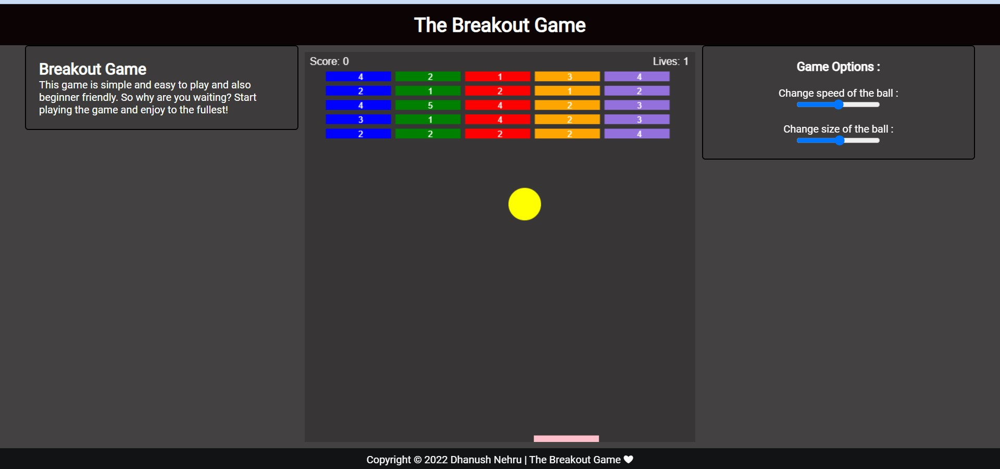

# **`BreakOut Game`**

## Techonologies used

The following technologies are used to create the game

- HTML 
- CSS
- JAVASCRIPT
## Images

<!--  -->

## Rules of the game

1. The goal of the game is to **break all the numbered blocks** on the top of the screen using the ball.
2. The number on the each block is reduced by one when the ball hits it.
3. The block disappears / breaks when the number on the block **reduces to zero**.
4. Game has a rectangular board on the bottom of screen that can be moved horizontally but not vertically using mouse.
5. Each new game has **three lives**. when the ball hits the ground the lives count is decreased by one.
6. Player has to make sure that ball lands on the **rectangular board instead of ground**.
7. **Game finishes** when the ball hits the ground for the third time.

## Features

- **Interactive Gameplay:** Engage in an exciting gaming experience by breaking numbered blocks using the ball and a movable rectangular board.
- **Limited Lives:** Enjoy the challenge of the game with a set of three lives, carefully ensuring the ball lands on the board and not the ground.
- **Simple UI Design:** Enjoy a user-friendly interface designed with HTML, CSS, and JavaScript, ensuring a seamless and enjoyable gaming experience.

- **Customizable Difficulty:** The size and speed of the ball can be changed to increase/decrease the difficulty of the game.

## Gitpod

In the cloud-free development environment where you can directly start coding.

The below command will open up the index.html in a browser in gitpod 
`python -m http.server 8000`

You can use Gitpod in the cloud 

## Controls
- Move mouse to control the paddle, or use 'A'and the left arrow key or 'D' and the right arrow key for left and right movement respectively.

## Linting Status

Created with 

Feel free to contribute for better designs and improvements ✌️
Let's play the game, drop :star: if you liked it.

*Thanks for dropping by.* 🤝

### Connect 👉 [**Twitter**](https://twitter.com/Dhanush_Nehru) **/** [**Instagram**](https://www.instagram.com/dhanush_nehru/) **/** [**Github**](https://github.com/DhanushNehru/) **/** [**Youtube**](https://www.youtube.com/@dhanushnehru?sub_confirmation=1) **/** [**Newsletter**](https://dhanushn.substack.com/) **/** [**Discord**](https://discord.com/invite/Yn9g6KuWyA)

